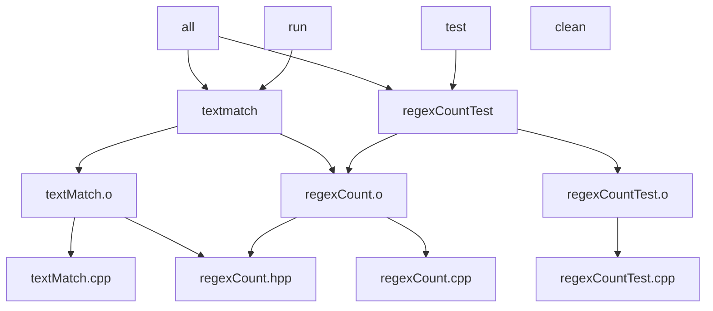

# textmatch Makefile Dependency Diagram

Reference for Exercise 31 / 32 (Team Text Match). The diagram itself must still
be hand drawn and uploaded to Brightspace.

Rules from the exercise:

- Include every file in the build: `.cpp`, `.hpp`, `.o`, and both executables
- Include the targets `clean`, `run`, and `test`
- Draw an arrow from each target to each of its prerequisites
- Headers come from the project's own `#include`s only (not `<iostream>` etc.)

## Includes Found in the Source

| File | Project header included |
| --- | --- |
| `textMatch.cpp` | `regexCount.hpp` |
| `regexCount.cpp` | `regexCount.hpp` |
| `regexCountTest.cpp` | none (no project `#include`) |
| `regexCount.hpp` | none (only `<string_view>`) |

`regexCountTest.cpp` currently includes nothing, so `regexCountTest.o` depends
only on `regexCountTest.cpp`. The executable `regexCountTest` still links
`regexCount.o`, the same way `srcMLXPathCountTest` links `srcMLXPathCount.o` in
the Build Files example.

## Diagram

Arrows point from a target to its prerequisite.



Plain-text version of the same layout:

```text
  all ------------+------------------+
                  |                  |
  run --------> textmatch      regexCountTest <-------- test
                  |       \     /      |
                  v        v   v       v
            textMatch.o  regexCount.o  regexCountTest.o
               |    \       /    |          |
               v     v     v     v          v
     textMatch.cpp  regexCount.hpp  regexCount.cpp  regexCountTest.cpp

  clean   (no prerequisites)
```

## Edge List (every arrow to draw)

| Target | Prerequisite |
| --- | --- |
| `all` | `textmatch` |
| `all` | `regexCountTest` |
| `run` | `textmatch` |
| `test` | `regexCountTest` |
| `textmatch` | `textMatch.o` |
| `textmatch` | `regexCount.o` |
| `regexCountTest` | `regexCountTest.o` |
| `regexCountTest` | `regexCount.o` |
| `textMatch.o` | `textMatch.cpp` |
| `textMatch.o` | `regexCount.hpp` |
| `regexCount.o` | `regexCount.cpp` |
| `regexCount.o` | `regexCount.hpp` |
| `regexCountTest.o` | `regexCountTest.cpp` |

`clean` is drawn as its own node with no arrows. 13 arrows total and 13 nodes:
4 phony targets (`all`, `run`, `test`, `clean`), 2 executables, 3 object files,
3 source files, and 1 header.

## Things That Commonly Get Marked Wrong

- An arrow from `regexCountTest.o` to `regexCount.hpp`: the test source does
  not include it
- Missing `regexCount.hpp` under `textMatch.o` or `regexCount.o` (both `.cpp`
  files include it)
- Missing `regexCount.o` under `regexCountTest` (shared by both executables)
- Arrows drawn the wrong way (prerequisite to target)
- Executables pointing straight at `.cpp` files instead of `.o` files
- Leaving out `clean`, `run`, or `test`

## Matching Makefile

The full Makefile this diagram describes, verified to build, run (`26`
matches on `sample.txt`), and test in a scratch copy:

```make
# Build for textmatch

.PHONY:all
all : textmatch regexCountTest

textmatch : textMatch.o regexCount.o
	g++ textMatch.o regexCount.o -o textmatch

textMatch.o : textMatch.cpp regexCount.hpp
	g++ -c textMatch.cpp

regexCount.o : regexCount.cpp regexCount.hpp
	g++ -c regexCount.cpp

regexCountTest : regexCountTest.o regexCount.o
	g++ regexCountTest.o regexCount.o -o regexCountTest

regexCountTest.o : regexCountTest.cpp
	g++ -c regexCountTest.cpp

.PHONY:run
run : textmatch
	./textmatch '[A-Za-z]+' sample.txt

.PHONY:test
test : regexCountTest
	./regexCountTest

.PHONY:clean
clean :
	@rm -f textmatch regexCountTest textMatch.o regexCount.o regexCountTest.o
```
